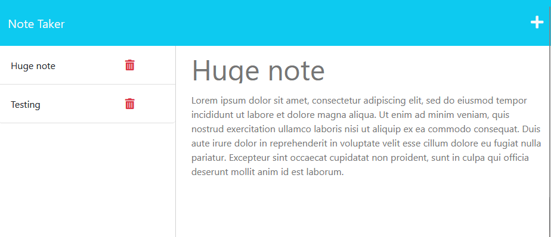

# Note Taker

## Description

Connecting an existing frontend note-taking application with a new `express` backend. Handing GET/POST/DELETE requests and updating the JSON file database and view.

## Table of Contents

- [Deployment Demo](#deployment-demo)
- [Local Installation](#local-installation)

## Deployment Demo

[Heroku deployment demo](https://notetaker-rb-7eb1eeb8328b.herokuapp.com/)

## Local Installation

1. `npm i`
2. `node index.js`
